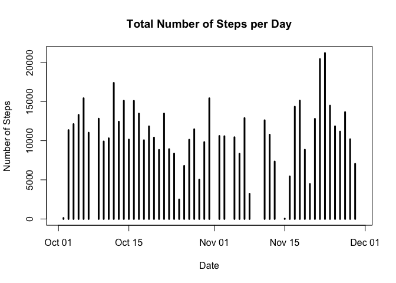
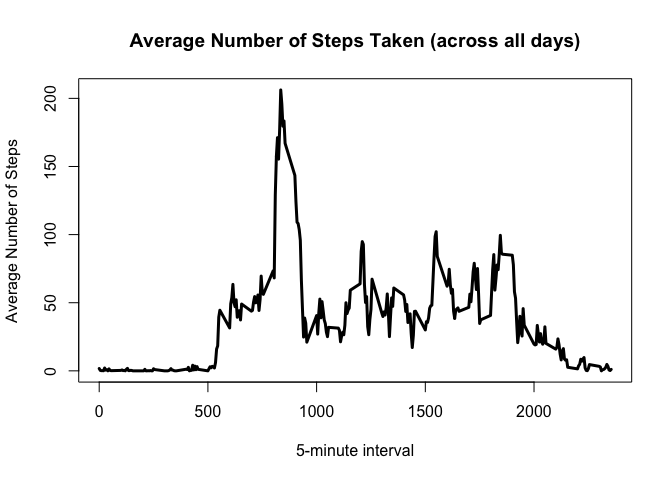
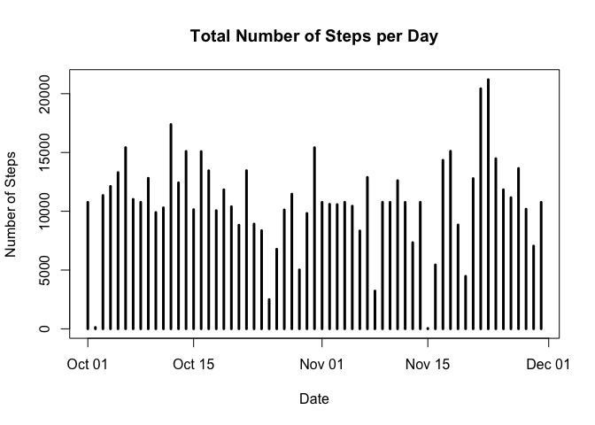
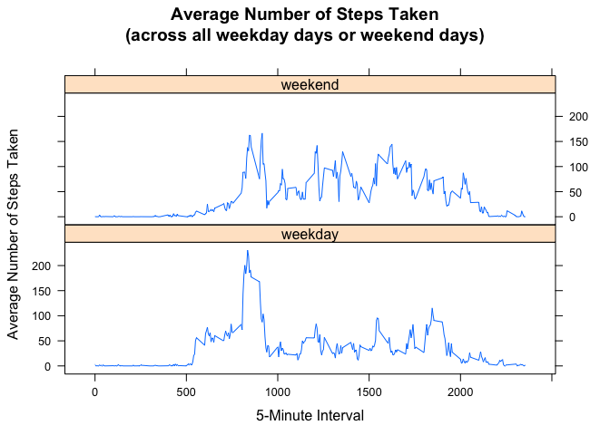

# Reproducible Research: Peer Assessment 1

## Loading and preprocessing the data
The variables included in the dataset *Activity monitoring data* are:

- **steps**: Number of steps taking in a 5-minute interval (missing values are coded as NA)

- **date**: The date on which the measurement was taken in YYYY-MM-DD format

- **interval**: Identifier for the 5-minute interval in which measurement was taken

The dataset is stored in a comma-separated-value (CSV) file and there are a total of 17,568 observations.

Unzip the file, if necessary, and load the data in *activity* variable:


```r
if(!file.exists("activity.csv")){
    unzip("activity.zip")
}
activity <- read.csv("activity.csv")
```

Convert the data in a "Date" format:

```r
Sys.setlocale("LC_TIME", "en_US")
```

```
## [1] "en_US"
```

```r
activity$date <- strptime(activity$date, "%Y-%m-%d")
activity$date <- as.Date(activity$date)
```

## What is mean total number of steps taken per day?
Aggregate the data per day (and change the column names) to calculate the total number of steps per day:

```r
totalsteps <- with(activity, aggregate(steps, by = list(date), sum))
colnames(totalsteps) <- c("Date", "Steps")
```

Make a histogram of the total number of steps taken each day:

```r
plot(totalsteps, ylab = "Number of Steps", main = "Total Number of Steps per Day", type="h", lwd="3")
```

 

Calculate and report the mean and median of the total number of steps taken per day:

```r
mean(totalsteps$Steps, na.rm = TRUE)
```

```
## [1] 10766.19
```

```r
median(totalsteps$Steps, na.rm = TRUE)
```

```
## [1] 10765
```

## What is the average daily activity pattern?
Make a time series plot of the 5-minute interval (x-axis) and the average number of steps taken, averaged across all days (y-axis)

```r
averages <- aggregate(x=list(steps=activity$steps), by=list(interval=activity$interval), FUN=mean, na.rm=TRUE)
plot(averages, xlab="5-minute interval", ylab = "Average Number of Steps", main = "Average Number of Steps Taken (across all days)", 
     type="l", lwd="3")
```

 

Calculate the 5-minute interval, on average across all the days in the dataset, related to the maximum number of steps:

```r
averages[which.max(averages$steps),]
```

```
##     interval    steps
## 104      835 206.1698
```

## Imputing missing values
Calculate and report the total number of missing values in the dataset:

```r
missingvalues <- activity[is.na(activity$steps),]
nrow(missingvalues)
```

```
## [1] 2304
```

Create a new dataset that is equal to the original dataset but with the missing data filled in with the average number of steps taken, averaged across all days (y-axis), for the same 5-minute interval

```r
missingindexes <- which(is.na(activity$steps))
newactivity <- activity

for(index in missingindexes) {
    newactivity$steps[index] <- averages$steps[averages$interval==newactivity$interval[index]]
}
```

Make a histogram of the total number of steps taken each day:

```r
newtotalsteps <- with(newactivity, aggregate(steps, by = list(date), sum))
colnames(newtotalsteps) <- c("Date", "Steps")

plot(newtotalsteps, ylab = "Number of Steps", main = "Total Number of Steps per Day", type="h", lwd="3")
```

 

Calculate and report the mean and median total number of steps taken per day. 

```r
mean(newtotalsteps$Steps)
```

```
## [1] 10766.19
```

```r
median(newtotalsteps$Steps)
```

```
## [1] 10766.19
```

With the choosen strategy for filling in all of the missing values in the dataset, the mean value is same as before and the median value is higher. This seems to highly depend on how you impute the missing data.

## Are there differences in activity patterns between weekdays and weekends?
Create a new factor variable in the dataset with two levels – "weekday" and "weekend" indicating whether a given date is a weekday or weekend day.

```r
newactivity$date <- strptime(newactivity$date, "%Y-%m-%d")
newactivity$date <- as.Date(newactivity$date)
newactivity$weekday <- weekdays(newactivity$date)

weekday <- c("Monday", "Tuesday", "Wednesday", "Thursday", "Friday")
weekend <- c("Saturday", "Sunday")

newactivity$weekday[which(newactivity$weekday %in% weekday)] <- "weekday"
newactivity$weekday[which(newactivity$weekday %in% weekend)] <- "weekend"
```

Make a panel plot containing a time series plot of the 5-minute interval and the average number of steps taken, averaged across all weekday days or weekend days. 

```r
library(lattice)

aggregatedData <- with(newactivity, aggregate(steps ~ interval * weekday, FUN = mean))

xyplot( steps ~ interval | weekday, aggregatedData, type = "l", layout = c(1,2), 
        main = "Average Number of Steps Taken\n(across all weekday days or weekend days)", xlab = "5-Minute Interval",
        ylab = "Average Number of Steps Taken")
```

 
